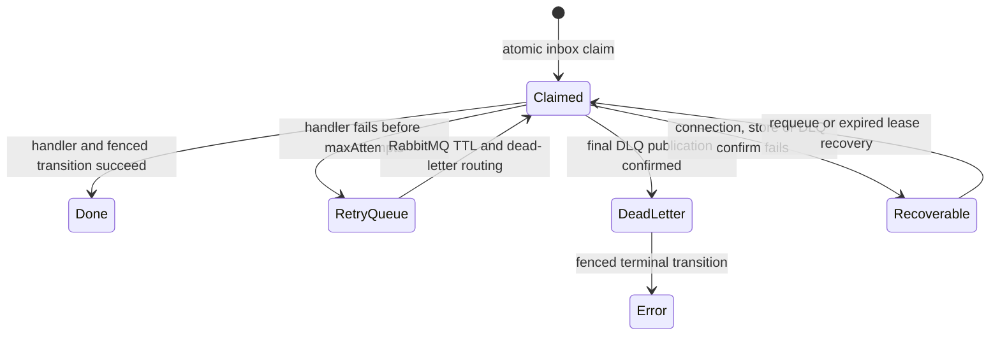
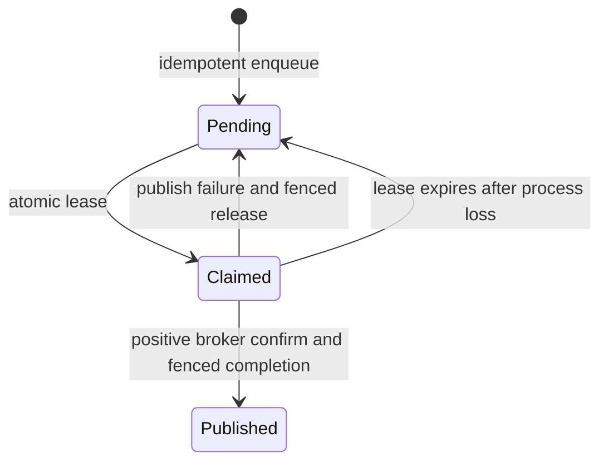

# Resilience model

## Consumer state machine

RabbitMQ owns the delivery attempt count. Infrastructure failures before handler execution and any live inbox lease are requeued, so they do not consume `x-death` attempts. Handler failures are rejected into the configured retry topology.

An inbox claim has three results:

- `completed`: the event is terminal and the delivery can be acknowledged as a duplicate.
- `busy`: an unexpired lease already owns the event; the delivery is delayed locally and requeued, including after a reconnect in the same process.
- `acquired`: the handler may run with the returned fencing token.

Only the current fencing token may write `DONE`, `RETRY` or `ERROR`. A late handler from an expired generation cannot overwrite the new owner.

## Publisher state machine

A positive publisher confirm proves RabbitMQ accepted the publication, but the process can fail before persisting `PUBLISHED`. The row is then recovered and may be published again. Consumers and domain operations therefore remain idempotent.

## Connection lifecycle

The AMQP protocol heartbeat detects half-open sockets. Connection and channel `error` or `close` events invalidate the generation. Recovery cancels and closes the old generation, waits with bounded exponential jitter and creates a new connection and confirm channel. No polling heartbeat, uptime restart, idle exit or process-level signal handler is installed.

## Shutdown

Consumer shutdown performs these operations in order:

1. Stop accepting a new recovery generation.
2. Cancel active AMQP consumers.
3. Abort handler signals.
4. Wait up to `shutdownTimeoutMs` for deliveries to settle.
5. Close cleanly or force-close the channel so RabbitMQ can recover unacknowledged deliveries.

Publisher shutdown stops the periodic outbox pass, waits for in-process confirms and closes its long-lived channel.
